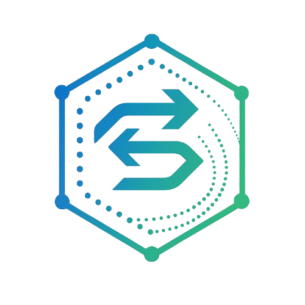

<div align="center">
  
  <h1>StreaminTCP-UDP</h1>
  <p><strong>Protocolo de transmissão avançado com diluição de dados sobre UDP</strong></p>
  
  [](LICENSE)
  []()
  []()
</div>

<hr>

## 📖 **Visão Geral**

O **StreaminTCP-UDP** é um projeto inovador que desenvolve um protocolo customizado sobre UDP utilizando uma técnica revolucionária de **"diluição" de dados**. Ao invés de depender de confirmações (ACKs) e retransmissões típicas do TCP, o protocolo emprega Forward Error Correction (FEC) para garantir transmissão robusta e de baixa latência mesmo em ambientes com alta perda de pacotes.

<details>
<summary><b>🎯 Conceito Principal</b></summary>
<br>
A partir de <b>N bytes</b> de informação, o sistema gera <b>k × N bytes</b> de dados redundantes, permitindo que qualquer conjunto suficiente desses bytes (mesmo que não sejam os exatos) possibilite a reconstrução completa da mensagem original.
</details>

<hr>

## ✨ **Características Principais**

<div align="center">

| 🔄 **Adaptação Dinâmica** | ⚡ **Baixa Latência** | 🛡️ **Robustez** | 📡 **Eficiência** | 🤖 **IA Integrada** |
|--------------------------|----------------------|-----------------|-------------------|-------------------|
| Ajusta redundância conforme condições da rede | Elimina overhead de ACKs | Tolera perdas significativas | Otimiza uso de banda | ML para otimização automática |

</div>

<hr>

## 🎯 **Aplicações**

<table>
  <tr>
    <td width="50%" valign="top">
      <h3>🚁 Principais Casos de Uso</h3>
      <ul>
        <li><b>Transmissão de vídeo em tempo real</b> (drones, vigilância)</li>
        <li><b>Redes IoT</b> em ambientes adversos</li>
        <li><b>Comunicações via satélite</b> (LEO, missões espaciais)</li>
        <li><b>Veículos autônomos</b> (V2V, V2I)</li>
        <li><b>Telemedicina</b> (cirurgias remotas)</li>
        <li><b>Realidade Virtual/Aumentada</b></li>
      </ul>
    </td>
    <td width="50%" valign="top">
      <h3>🌍 Setores de Impacto</h3>
      <ul>
        <li>Telecomunicações e 5G</li>
        <li>Saúde e biotecnologia</li>
        <li>Transporte e mobilidade</li>
        <li>Energia e infraestrutura</li>
        <li>Entretenimento e educação</li>
        <li>Defesa e segurança</li>
      </ul>
    </td>
  </tr>
</table>

<hr>

## 🏗️ **Estrutura do Projeto**

```
StreaminTCP-UDP/
├── 📁 docs/                    # Documentação organizada
│   ├── 📄 introducao.md        # Introdução ao projeto
│   ├── 📁 tecnico/             # Documentação técnica
│   │   ├── 📄 documento_tecnico.md
│   │   ├── 📄 protocolo_udp_redundante.md
│   │   ├── 📄 ia.md
│   │   ├── 📄 blockchain.md
│   │   ├── 📄 satellites.md
│   │   ├── 📄 sdn_nfv.md
│   │   ├── 📄 outras_tecnologias.md
│   │   └── 📄 ideias_inovadoras.md
│   ├── 📁 mercado/             # Análise de mercado
│   │   └── 📄 mercado_monetizacao.md
│   ├── 📁 planejamento/        # Planejamento do projeto
│   │   ├── 📄 plano.md
│   │   └── 📄 checklist.md
│   └── 📄 docs.txt             # Documento original
├── 📁 src/                     # Código fonte (em desenvolvimento)
├── 📁 tests/                   # Testes automatizados (pendente)
├── 📁 demos/                   # Aplicações demonstrativas (pendente)
├── 📁 tools/                   # Ferramentas auxiliares
│   └── 📄 index.html           # InovaDocs - Gerador de Markdown
├── 📁 config/                  # Configurações do projeto
│   ├── 📄 project.json         # Configuração principal
│   └── 📄 .env.example         # Exemplo de variáveis de ambiente
├── 📁 assets/                  # Recursos estáticos
│   └── 📄 logo.png             # Logo do projeto
└── 📄 README.md                # Este arquivo
```

<hr>

## 🚀 **Status do Projeto**

<div align="center">
  
</div>

<table>
  <tr>
    <th>✅ Concluído (26.8%)</th>
    <th>🔄 Em Desenvolvimento</th>
    <th>📋 Próximos Passos</th>
  </tr>
  <tr valign="top">
    <td>
      <ul>
        <li><b>Documentação completa</b></li>
        <li><b>Planejamento técnico</b></li>
        <li><b>Protótipo web</b> - InovaDocs</li>
        <li><b>Estrutura organizada</b></li>
      </ul>
    </td>
    <td>
      <ul>
        <li>Implementação do protocolo core</li>
        <li>Algoritmos FEC e adaptação</li>
        <li>Integração com IA/ML</li>
        <li>Testes e validação</li>
      </ul>
    </td>
    <td>
      <ol>
        <li>Implementar protocolo UDP básico</li>
        <li>Desenvolver testes unitários</li>
        <li>Criar simulador de rede</li>
        <li>Implementar demos práticas</li>
        <li>Integração com IA</li>
      </ol>
    </td>
  </tr>
</table>

<hr>

## 🛠️ **Tecnologias**

<div align="center">
  <table>
    <tr>
      <th>🔧 Core</th>
      <th>🌐 Integrações</th>
      <th>🧪 Dev Tools</th>
    </tr>
    <tr valign="top">
      <td>
        <ul>
          <li>Python/C++</li>
          <li>UDP, FEC</li>
          <li>TensorFlow, PyTorch</li>
        </ul>
      </td>
      <td>
        <ul>
          <li>5G/IoT: MQTT, CoAP</li>
          <li>Edge Computing</li>
          <li>Blockchain</li>
          <li>SDN/NFV</li>
        </ul>
      </td>
      <td>
        <ul>
          <li>pytest, unittest</li>
          <li>Network simulators</li>
          <li>Docker, Kubernetes</li>
          <li>Monitoramento em tempo real</li>
        </ul>
      </td>
    </tr>
  </table>
</div>

<hr>

## 📊 **Benefícios Esperados**

<div align="center">
  <table>
    <tr>
      <th>Métrica</th>
      <th>TCP Tradicional</th>
      <th>StreaminTCP-UDP</th>
    </tr>
    <tr>
      <td><b>Latência</b></td>
      <td>Alta (ACKs)</td>
      <td>Baixa (sem ACKs)</td>
    </tr>
    <tr>
      <td><b>Tolerância a perdas</b></td>
      <td>Baixa</td>
      <td>Alta (FEC)</td>
    </tr>
    <tr>
      <td><b>Throughput</b></td>
      <td>Variável</td>
      <td>Consistente</td>
    </tr>
    <tr>
      <td><b>Adaptabilidade</b></td>
      <td>Limitada</td>
      <td>Dinâmica (IA)</td>
    </tr>
    <tr>
      <td><b>Eficiência</b></td>
      <td>Média</td>
      <td>Alta</td>
    </tr>
  </table>
</div>

<hr>

## 🎮 **Demos e Ferramentas**

<details>
<summary><b>🌐 InovaDocs</b></summary>
<br>
Ferramenta web para conversão automática de documentos técnicos em Markdown organizado.

<b>Como usar:</b>
<ol>
  <li>Abra <code>tools/index.html</code> no navegador</li>
  <li>Cole seu texto técnico</li>
  <li>Clique em "Gerar Arquivos Markdown"</li>
  <li>Baixe o arquivo gerado</li>
</ol>
</details>

<hr>

## 🤝 **Como Contribuir**

<table>
  <tr>
    <td width="33%" valign="top">
      <h3 align="center">🔧 Desenvolvedores</h3>
      <ol>
        <li>Fork o repositório</li>
        <li>Crie uma branch para sua feature</li>
        <li>Implemente seguindo os padrões</li>
        <li>Adicione testes</li>
        <li>Submeta um Pull Request</li>
      </ol>
    </td>
    <td width="33%" valign="top">
      <h3 align="center">📚 Pesquisadores</h3>
      <ul>
        <li>Contribua com papers e referências</li>
        <li>Sugira melhorias nos algoritmos</li>
        <li>Participe das discussões técnicas</li>
      </ul>
    </td>
    <td width="33%" valign="top">
      <h3 align="center">💼 Empresas</h3>
      <ul>
        <li>Teste em casos de uso reais</li>
        <li>Forneça feedback sobre aplicações</li>
        <li>Explore parcerias estratégicas</li>
      </ul>
    </td>
  </tr>
</table>

<hr>

## 📈 **Roadmap**

<div align="center">
  <table>
    <tr>
      <th>🎯 2024 Q4</th>
      <th>🎯 2025 Q1</th>
      <th>🎯 2025 Q2</th>
    </tr>
    <tr valign="top">
      <td>
        <ul>
          <li>[ ] Implementação do protocolo básico</li>
          <li>[ ] Testes iniciais e validação</li>
          <li>[ ] Documentação técnica detalhada</li>
        </ul>
      </td>
      <td>
        <ul>
          <li>[ ] Integração com IA/ML</li>
          <li>[ ] Demos práticas funcionais</li>
          <li>[ ] Otimizações de performance</li>
        </ul>
      </td>
      <td>
        <ul>
          <li>[ ] Integrações com 5G/IoT</li>
          <li>[ ] Testes em larga escala</li>
          <li>[ ] Preparação para produção</li>
        </ul>
      </td>
    </tr>
  </table>
</div>

<hr>

## 📞 **Contato e Suporte**

<div align="center">
  <a href="https://github.com/username/StreaminTCP-UDP/issues">
    
  </a>
  <a href="https://github.com/username/StreaminTCP-UDP/discussions">
    
  </a>
  <a href="docs/">
    
  </a>
</div>

<hr>

## 📄 **Licença**

Este projeto está licenciado sob [MIT License](LICENSE) - veja o arquivo LICENSE para detalhes.

<hr>

<div align="center">
  <h3>🌟 Reconhecimentos</h3>
  <p>Agradecemos a todos os pesquisadores e desenvolvedores que contribuem para o avanço das comunicações resilientes e protocolos inovadores.</p>
  <br>
  <b>⭐ Se este projeto foi útil, considere dar uma estrela no GitHub!</b>
  <p><i>Última atualização: Dezembro 2024</i></p>
</div>
