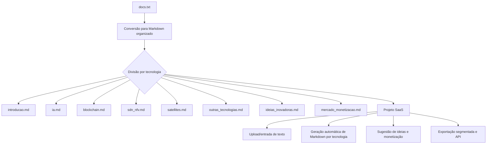

# Plano para Conversão, Organização e Projeto SaaS baseado no `docs.txt`

---

## Objetivo Geral

- Ler o arquivo `docs.txt`.
- Converter seu conteúdo para Markdown organizado.
- Dividir o conteúdo em múltiplos arquivos `.md` temáticos por tecnologia.
- Propor um projeto SaaS simples, rápido, aplicável e escalável para resolver dores reais relacionadas a organização e análise de documentos técnicos.

---

## Estrutura dos Arquivos Markdown

### 1. `introducao.md`
- Conceito da técnica de diluição de dados.
- Funcionalidades gerais do protocolo.
- Aplicações gerais.

### 2. `ia.md`
- Uso de Inteligência Artificial e Machine Learning para adaptação dinâmica.
- Benefícios e exemplos.

### 3. `blockchain.md`
- Integração com Blockchain para segurança e rastreabilidade.
- Desafios técnicos.

### 4. `sdn_nfv.md`
- Uso de Redes Definidas por Software e Virtualização de Funções de Rede.
- Benefícios para gestão, escalabilidade e integração.

### 5. `satellites.md`
- Aplicações em comunicações via satélite, constelações LEO.
- Benefícios e desafios.

### 6. `outras_tecnologias.md`
- Edge Computing, Fog Computing, Digital Twins, Cognitive Radio, etc.

### 7. `ideias_inovadoras.md`
- Lista das 100 ideias + 10 ideias revolucionárias.
- Possíveis integrações com as tecnologias.

### 8. `mercado_monetizacao.md`
- Mercados, setores e estratégias de monetização.
- Roadmap e desafios regulatórios.

---

## Projeto SaaS Proposto

### Nome Sugerido
**InovaDocs**

### Funcionalidades Básicas
- Upload ou escrita de documentos técnicos.
- Conversão automática para arquivos Markdown organizados por tecnologia.
- Sugestão automática de ideias de aplicação e monetização.
- Exportação segmentada dos arquivos `.md`.
- API para integração com plataformas de inovação e P&D.

### Dores que Resolve
- Facilita a organização e análise de documentos técnicos complexos.
- Acelera o planejamento de inovação tecnológica.
- Ajuda startups e equipes técnicas a estruturar propostas e roadmaps rapidamente.

### Potencial SaaS
- Assinatura para uso ilimitado.
- Planos para startups, consultorias e grandes empresas.
- API para integrações.

---

## Diagrama Geral

---

## Resumo

- **Conversão:** `docs.txt` para Markdown organizado.
- **Divisão:** múltiplos arquivos `.md` por tecnologia.
- **Projeto SaaS:** plataforma para organizar, analisar e exportar documentos técnicos, com potencial para evoluir para um serviço escalável e lucrativo.

---